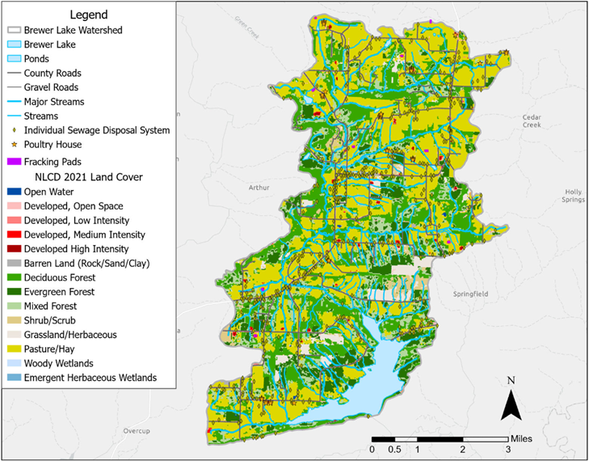
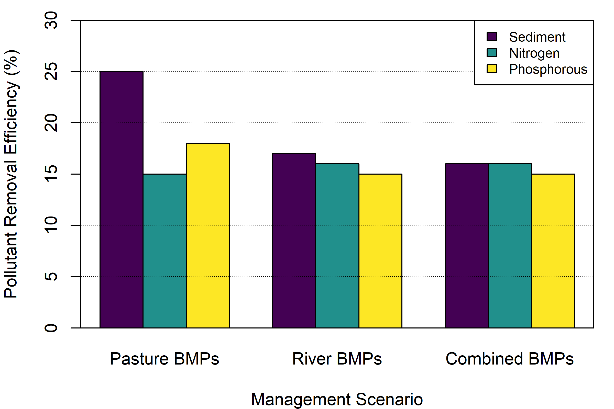
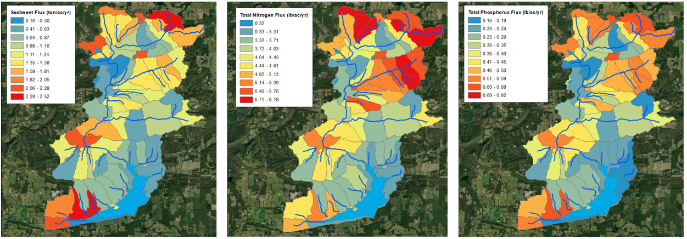
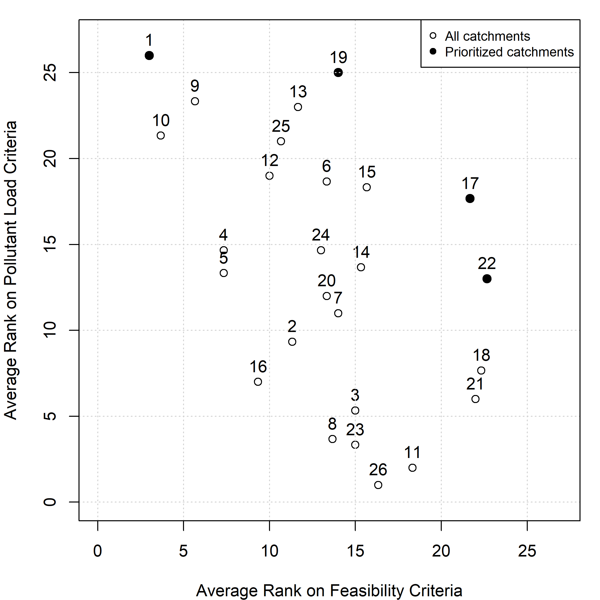
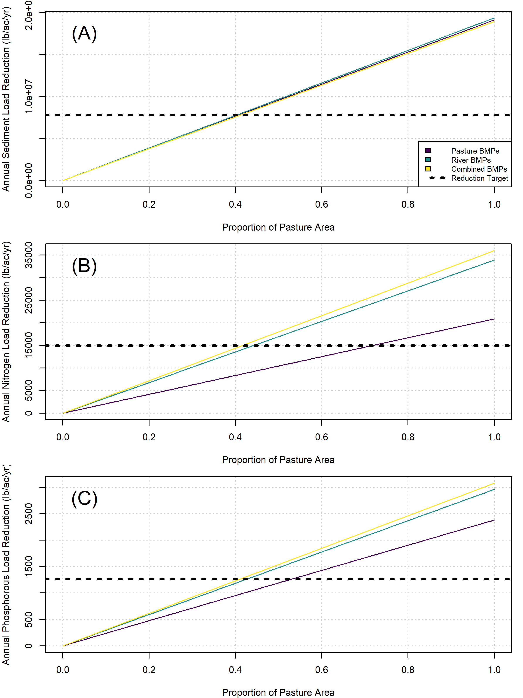

```{r options, include=FALSE}
#Markdown options
knitr::opts_chunk$set(echo=FALSE, warning=FALSE, message = FALSE) 

##########
#Clear local memory
rm(list=ls(all=TRUE))

##########
#Load R package containing color palette
library(viridis)

#Load R package containing lots of plotting commands
#library(ggplot2)
#library(forcats)
#library(gridExtra)
```

# **Author Notes**

This document is a working draft of a journal paper summarizing the Brewer Lake watershed study. A few notes:  

- *Authorship*: The authorship list is simply a first volley based on contributions to the USACE report and journal paper to date. Team members can be added as needed, and we need to discuss the relative order of authors.  
- *Audience*: Largely focused on applied water science community and practitioners developing watershed management plans. Secondary audience is government entities funding watershed assessments. Probably best reached through an open access journal.  
- *Proposed Outlet*: [Water](https://www.mdpi.com/journal/water)


# **Abstract**

Watershed plans help identify priorities for pollutant reduction, ecological restoration, flood mitigation, and other management challenges. Modeling tools related to hydrology, sedimentation, nutrient dynamics, and other watershed processes inform these plans and allow managers to explore scenarios. While models can indicate potentially strategic locations for best management practices, individual models often focus on a narrow range of outcomes (e.g., hydrology or water quality) rather than the multiple objectives sought by managers. Therefore, methods are needed to integrate multiple lines of evidence from separate models into an overarching watershed plan. We present a case study for developing a weight-of-evidence in the Brewer Lake watershed in Arkansas. Two alternative methods were used to prioritize catchments relative to objectives for sediment, nitrogen, and phosphorous loading. First, we ranked catchments based on multiple criteria separately along with proxies for logistical factors like cost and efficacy. Second, a weighted decision matrix was developed for comparing sub-catchments within the watershed by normalizing outcomes to a consistent 1 to 5 scale and combining outcomes through a weighted average. Ultimately, these two techniques produced independent rank-ordered lists of priority catchments, which allowed managers to embrace the strengths of each method and avoid the pitfalls of any given analytical technique. 

**Keywords**: watershed plan, multi-criteria decision analysis, HSPF, watershed modeling, integrated modeling, best management practices


# **1. Introduction**

A watershed is “the landscape that contributes surface water to a single location, such as a point on a stream or river, or a single wetland, lake or other waterbody” (Flotemersch et al. 2016). Catchments integrate physical, chemical, and biological processes and provide a fundamental unit for analysis of lands and waters (Montgomery et al. 1995), although watersheds may not align with governance issues due to boundary difference, accountability structures, and participatory processes (Cohen and Davidson 2011). Watershed assessments can be driven by large-scale policy goals (e.g., the US Environmental Protection Agency's 319 program, Hanson et al. 2022) as well as local project-scale goals (e.g., stream restoration prioritization, Menchino et al. 2025). However, generally speaking, watershed assessments seek to capture the status and trends of different functional outcomes like landscape condition, geomorphology, hydrology, water quality, habitat, or biological conditions (USEPA 2012). 

Effective watershed management has long acknowledged the need for integrating multiple outcomes and goals (Montgomery 1995, Wang et al. 2016). An integrated assessment approach ultimately facilitates understanding of individual components as well as the integrity of the watershed as a whole (Flotemersch et al. 2016). Modeling tools have not only matured for assessing and forecasting hydrologic and water quality processes (e.g., Shiferaw et al. 2025, Chao et al. 2023) but also ecological and social outcomes (e.g., McKay et al. 2019, Meerow and Newell 2017). To effectively reach decision makers, diverse outcomes need to be synthesized into overarching findings and priorities addressing multiple objectives (Montgomery 1995, Lamy et al. 2002, Newbold 2002). Multi-criteria decision analysis (MCDA) techniques have emerged as particularly useful methods for watershed assessment with synthesis methods reliant on visual summaries (Hoang et al. 2017), spatially distributed methods (Lim and Lee 2009, Yaryan-Hall and Bledsoe 2023), and coupling with optimization methods (Li et al. 2023). 

Multi-criteria watershed assessment is emerging as an important paradigm for navigating trade-offs between diverse objectives; however, tools need to be translated to align with the diverse contexts in which watershed planning occurs. For instance, many MCDA methods have emphasized the benefits of achieving objectives (e.g., Meerow and Newell 2017, Yaryan-Hall and Bledsoe 2023) rather than challenges of working under constraints like limited financial resources or land ownership. A focus on objectives without constraints could obscure trade-offs inherent in some watershed management choices (Newbold 2002). Furthermore, while diverse methods exist for comparing lines of evidence (Linkov et al. 2009), many applications focus on use of a single analytical method at the expense of using multiple methods with alternative assumptions or pitfalls. Lastly, watershed assessment exists across a spectrum from preliminary site screening to long-term health monitoring, and MCDA tools are needed that align with these different levels of analytical effort (Larsen et al. 2016, Harris et al. 2023).

In this paper, we contribute to the growing body of methods using MCDA to inform watershed management. Specifically, our objectives are to (1) incorporate constraints like cost and land ownership into MCDA frameworks, (2) show how multiple MCDA-based methods can be brought to bear at a single location to increase decision confidence, and (3) demonstrate simple MCDA methods that are aligned with preliminary watershed planning. We present these methods in the context of developing a watershed management plan for the Brewer Lake watershed in Arkansas, USA. The methods and techniques shown here were tailored to the geographic and project constraints for this watershed, and we offer these in the spirit of a case study exploring alternative approaches rather than research into preferred or superior approaches.


# **2. Methods**

Many stepwise processes have been proposed for developing watershed management plans centered on general land management concerns (e.g., Montgomery et al. 1995), pollutant load reduction (e.g., USEPA 2008), integrated assessment (e.g., USEPA 2012), and shared visioning with stakeholders (e.g., USACE 2022). These processes share commonalities in the steps and generally include topics like building context, setting objectives, understanding the status and trends of watershed condition, identifying effective management actions, and informing decisions. Here, we draw from each of these frameworks and take a question-centric approach to watershed planning. Specifically, our analysis focuses on six overarching questions, which then structure the subsequent methods and results sections.  

- *What is the context for this watershed (Section 2.1)*? Watersheds are complex social-ecological-technical systems with many interacting components and processes (McPhearson et al. 2021). Effective watershed management require understanding these dimensions of the system as well as how they have changed through time.  
- *What are the objectives and constraints for this planning process (Section 2.2)*? Management actions can only be prioritized with a clear understanding the the problems, opportunities, objectives, and constraints (USACE 2022). For instance, different actions could be identified as preferable relative to sediment load reduction and recreational access. Similarly, project constraints arise from issues like land ownership, jurisdictional limits, and site access (USEPA 2008), and analytical constraints related to model complexity, tolerable uncertainty, time, and available resource drive choices about the level of effort for a given analysis (Harris et al. 2023).  
- *What numerical targets are feasible and realistic (Section 2.3)*? Objective setting often leads to laudably ambitious goals, but numerical targets are sometimes set at unattainable levels from a technical perspective. Watershed planning sometimes requires preliminary analyses to avoid miscommunication and the potential for a gap between ambition and reality.  
- *What is the status and trends of key watershed properties (Section 2.4)*? Objective setting identifies outcomes that are important to watershed stakeholders, which may then be modeled or monitored over time to understand the condition and trajectory of the watershed.  
- *What areas are priorities for management actions (Section 2.5)*? Specific parts of the watershed (e.g., smaller catchments, project sites) may then be prioritized relative to the condition assessment and goals. These locations are often identified based on "problem areas", site feasibility (i.e., "low hanging fruit"), land ownership, and other factors, which may then be compared with a variety of techniques.  
- *How do prioritized activities contribute to overarching goals (Section 2.6)*? Many watershed studies prioritize actions in a small portion of the watershed, but there is often a need to revisit watershed objectives as a whole to understand the importance of these smaller scale actions at a larger scale (Menichino et al. 2025).


## *2.1. Brewer Lake Watershed*

Brewer Lake is located in central Arkansas within the Arkansas Valley ecoregion, a transitional zone between the Ozark Mountains to the north and the Ouachita Mountains to the south. In 1983, the Brewer Lake reservoir was completed and is fed by Cypress Creek, which drains a 36 mi^2^ watershed (HUC boundary 111102050201). The reservoir serves as the primary drinking water supply for the city of Conway, and this municipal water supply reservoir provides the main context for this watershed study. 

The high ridge slopes and moderate valley slopes of the Cypress Creek watershed make it representative of the broader Arkansas Valley physiographic province in which it resides (Hart 2014). Soils are predominantly sandy loam and silty loam with good drainage in the hydrologic soil groups C, C/D, and D. The climate is humid subtropical with hot, humid summers and mild winters. Average annual rainfall is 58 inches (NLDAS) with higher amounts in spring (5-7 inches per month) and lower amounts in summer and fall (3-5 inches per month). Average annual streamflow is 32 cfs (USGS Streamflow Gauge No. 07261090) with peak flows of more than 16,500 cfs, although zero flow periods can also extend for months (Santeford and Martin 1980). These hydrographic patterns are consistent with the intermittent flashy and intermittent runoff flow regimes characteristic of regional rivers (Leasure et al. 2016). Historically, the Arkansas Valley Hills ecoregion (EPA Level IV, Woods et al. 2004) would have included oak-hickory forest or oak-hickory-pine forest, and significant portions of the watershed remain as second- or third-growth deciduous forest, although evergreen forest and pasture are now common land uses as well (Hart 2014). Based on the 2020 census, population density is relatively low in the watershed with 36.5 residents per mi^2^ (96 residents per mi^2^ nationwide), and residents experience higher rates of poverty and unemployment than state averages (EJScreen 2025). 

Watershed land use reflects the long history of development as well as the low population density (Figure 1). Based on the 2021 National Land Cover Database, the major land use remains forest (45%), although forest types now include deciduous, evergreen, mixed, and shrub/scrub systems. The second most common land use is pasture (42%) with predominant agricultural effects stemming from confined animal feeding operations like poultry houses. Urban land uses are isolated (7%), and residents rely primarily on septic tanks for wastewater management. Road networks are also limited, although a significant extent of unpaved roads may be important sediment sources (**XXX**, personal communication). Oil extraction using hydraulic fracturing (i.e., “fracking”) has increased across the entire Arkansas River Valley ecoregion (Baker et al. 2018), including the Cypress Valley watershed (Hart 2014), with potential impacts of these activities on water availability (Davis 2012) and stream biota (Johnson et al. 2015). Notably, riparian areas in the watershed remain relatively intact with 62% of area within 100-ft of streams in forested land uses. 

```{r fig.cap="Figure 1. Brewer Lake watershed land use and potential sources of water quality degradation (i.e., septic systems, poultry houses, and hydraulic fracturing extraction sites)"}
#Insert a figure summarizing Brewer Lake land use and management challenges
#NOTE: This could be created in R for future use...

```

Brewer Lake was completed in 1983 through a partnership between the U.S. Army Corps of Engineers and the Conway Corporation, based on authorization from the Water Resources Development Act of 1974 (PL93-251, Title 1, Sec. 10). The primary purpose of the 28,500 acre-foot reservoir is water supply for over 70,000 residents in the city of Conway as well as nearby counties, although the lake is also used for fishing and recreation. Water quality changes can occur with land use change, and sediment, nitrogen, and phosphorous inputs to the lake are a particular focus for reservoir managers because of both drinking water requirements as well as secondary outcomes like harmful algal blooms and reduced reservoir life span (Mark Ferguson, Conway Corporation, personal observation). In the fall of 2020, a cyanobacterial bloom was observed intermittently, indicating a broader potential for water quality threats to this important drinking water source (Matthew Schroeder, Arkansas Game and Fish Commission, personal observation).

## *2.2. Watershed Planning Process*

(**Looking for Michael and Julianna's help here**).  

This study was conducted under a partnership between the U.S. Army Corps of Engineers and the Conway Corporation to develop a long-term vision for the watershed, identify preliminary management actions, and align opportunities with potential funding sources (e.g., USEPA's 319 program, USDA's Conservation Reserve Program, state grants). The study was conducted under an 18 month timeline with oversight from these entities as well as a technical advisory body with representatives from other federal and state agencies. While broader watershed goals were considered, the primary motivations center on the missions of these entities. 

A description of local problems and overarching management goals provided the foundation for data compilation, analyses, diagnosis of underlying stressors, and helped guide selection of management actions (USEPA 2008, USACE 2022). The process of problem identification and goal setting is a key opportunity for incorporating stakeholders in ecosystem management writ large (Dillard et al. 2021) and developing watershed plans specifically (USEPA 2008). Public participation exists on a large spectrum from  informing citizens of activities to empowering stakeholders in decision-making processes (IAP2 2018). For this study, stakeholders were involved through outreach activities to ensure that their concerns and aspirations were understood, considered, and reflected in the watershed plan. Biweekly progress meetings were conducted from October 2024 to December 2025 with technical stakeholders from Conway Corporation, federal agencies (USACE, NRCS, etc.), and the Arkansas Department of Agriculture. Additionally, the experiences of watershed residents, lake users, and other members of the public were incorporated through two facilitated public meetings (May 2025 and January 2026) and a public website. 

Three primary problem statements were synthesized from stakeholder input, subsequent technical analyses, and prior scientific studies in the watershed (e.g., Hart 2014). First, Brewer Lake provides municipal water supply for 70,000 residents, and both Conway Corporation and local residents want to ensure the security, resilience, and sustainability of this resource. Second, water quality is a growing concern among both lake managers and residents. On short time scales, this manifests as increasing nutrient loads and associated increases in water treatment cost for Conway Corporation. On longer time scales, sediment and nutrient delivery have the potential to reduce storage volume or increase the likelihood of algal blooms. Third, watershed residents expressed a desire to preserve the ecological integrity and beauty of this minimally developed landscape as a legacy of opportunities for future generations. A key constraint was identified as a a desire to avoid infringing on local property owners (e.g., through takings or regulation) in a watershed with almost exclusively private land ownership. 

The overarching goal for the watershed management plan was to identify a set of management actions and priority locations that help the community protect the watershed as a multi-generational asset and Conway Corporation secure a sustainable water supply. This vision sets the general trajectory for the watershed plan as a whole, but more refined objectives were needed to assess the relative merits of management activities (Table 2). The specific objectives for the watershed management plan center on nitrogen, phosphorous, and sediment as indicators of riverine water quality and sustainability of the water supply from the lake. Indicator metrics were selected for each objective with an emphasis on capturing large-scale and long-term trends. 

While the primary objectives centered on water quality, stakeholders expressed other areas of concern and interest in outcomes of watershed management. These secondary or ancillary objectives are not the focus of watershed management practices, so they will not be address here. However, these outcomes are important to track and communicate in the context of the broader vision for the watershed. 

```{r echo=FALSE}
#Create empty table
Table01 <- as.data.frame(matrix(NA, nrow = 7, ncol = 3))
colnames(Table01) <- c("Objectives", "Indicators", "Targets")

#Specify rows of the table
Table01[1,] <- c("PRIMARY OBJECTIVES", "", "")
Table01[2,] <- c("Reduce sediment loading with the implicit goals of minimizing riverine embeddedness, minimizing reservoir sedimentation, and reducing phosphorous delivery", "Average annual sediment yield (lb/ac/yr) at the outlet of each of 26 catchments", "15% reduction in annual load at the inlet to Brewer Lake based on a 2009-2023 baseline")
Table01[3,] <- c("Reduce nitrogen loading with the assumption that Brewer Lake algal blooms are nitrogen limited", "Average annual delivery of total nitrogen (lb/ac/yr) at the outlet of each of 26 catchments", "15% reduction in annual load at the inlet to Brewer Lake based on a 2009-2023 baseline")
Table01[4,] <- c("Reduce phosphorous loading to Brewer Lake to minimize long-term nutrient storage and eutrophication", "Average annual delivery of total phosphorous (lb/ac/yr) at the outlet of each of 26 catchments", "15% reduction in annual load at the inlet to Brewer Lake based on a 2009-2023 baseline")
Table01[5,] <- c("SECONDARY OBJECTIVES", "", "")
Table01[6,] <- c("Maximize drought resilience", "Qualitative assessment", "none")
Table01[7,] <- c("Facilitate resident enjoyment", "Qualitative assessment", "none")
Table01[8,] <- c("Foster watershed conditions that provide for regional biodiversity", "Qualitative assessment", "none")
Table01[9,] <- c("Promote multi-generational watershed stewardship", "Qualitative assessment", "none")

#Send output table rows into a single matrix
rownames(Table01) <- NULL
knitr::kable(Table01, caption="Table 1. Objectives, indicators, and targets for the Brewer Lake watershed management plan.", align="c") 
```

## *2.3. Exploratory Assessment of Feasible Targets*

(**Looking for Maya's help here.**)  

A numeric target or threshold for each indicator helps judge the relative success of watershed management actions in achieving the objectives. However, numerical targets are challenging to develop without technical information on feasibility in a specific geography. Initial targets were developed qualitatively and then confirmed using simple modeling exercises.

The technical advisory team established the initial numerical targets. The 2020 algal bloom in Brewer Lake was identified as an undesirable outcome by the technical stakeholder advisory group, and a general preference was identified for reducing nitrogen, phosphorous, and sediment loading to the reservoir. Load reductions were judged relative to a baseline of 2009-2023, which represents a recent period in which algal blooms were infrequent, short duration, or low consequence. A 15% reduction in loading was viewed as ambitious but achievable relative to long-term program tracking in other locations with water quality management programs like New York Harbor (HRF 2021) and Chesapeake Bay (Zhang et al. 2023).

These targets were then analyzed using the EPA’s Pollutant Load Estimation Tool (PLET) to estimate removal efficiency of three scenarios of best management practices (BMPs) at the watershed-scale. PLET is a spatially lumped calculator treating the entire watershed as one analytical domain. Land cover serves as the primary driver of removal efficiency in PLET, and the National Land Cover Data Set (NLCD) from 2021 was used to parameterize the model. This model provides a low level of effort for preliminary exploration of feasibility.

Three sets of BMPs were executed in PLET based on the pasture, river, and combined scenarios. The BMP calculator was configured such that similar practices were used in series, and dissimilar practices were used in parallel. All practices were assumed to be applied in series with either grassed or forested riparian buffers due to the well-described efficacy of buffer zones (Ayala-Torres et al. 2025). Area treated by each practice was calculated by dividing the current pasture area evenly into each set of practices. No BMP calculations were performed for urban areas due to the small extent of these areas in this watershed. The three exploratory scenarios were:  

- *Pasture BMPs*. This scenario focused on pasture lands as a key source of sediment and nutrient inputs and includes actions like cattle exclusion, rotational grazing, pasture planting, and alternative water supplies.  
- *River BMPs*. This scenario focused on actions within river corridors such as riparian buffer enhancement and streambank stabilization. These actions also assumed that river corridors may provide better alignment for real estate actions (e.g., voluntary programs, incentives, easements, acquisitions), given flooding potential and other regulatory limits (e.g., buffer ordinances).  
- *Combined BMPs*. This scenario combines the strategies into a single scenario applying both practices.

```{r}
#Specify area for achieving 15% goal based on PLET
PLET.area <- data.frame(matrix(NA, nrow=3, ncol=5))
colnames(PLET.area) <- c("Scenario", "Sediment", "Nitrogen", "Phosphorous", "Area.per")
PLET.area$Scenario <- c("Pasture BMPs", "River BMPs", "Combined BMPs")
PLET.area$Sediment <- c(25, 17, 16)
PLET.area$Nitrogen <- c(15, 16, 16)
PLET.area$Phosphorous <- c(18, 15, 15)
PLET.area$Area.per <- c(61.5, 43.0, 41.5)

#Specify pollutant removal efficiency from PLET
PLET <- data.frame(matrix(NA, nrow=3, ncol=4))
colnames(PLET) <- c("Scenario", "Sediment", "Nitrogen", "Phosphorous")
PLET$Scenario <- c("Pasture BMPs", "River BMPs", "Combined BMPs")
PLET$Sediment <- c(0.700, 0.709, 0.693)
PLET$Nitrogen <- c(0.422, 0.685, 0.728)
PLET$Phosphorous <- c(0.550, 0.684, 0.711)

#Specify colors for each of the constituents
PLET.colors <- viridis(3)
```


## *2.4. Assessing Watershed Condition*

(**Looking for Drew's help here, particularly with adding goodness-of-fit statistics for model calibration.**)  

As described, watershed management goals centered on sediment, nitrogen, and phosphorous. Water quality data were unavailable throughout the watershed at sufficient spatial or temporal resolution to identify sources and understanding the effects of management actions. Therefore, a spatially distributed watershed model was developed to inform watershed planning. When calibrated against historical data, watershed models can help reconstruct historical change in a basin (Yan and Edwards 2013) as well as forecast future conditions such as management (Davis 2012, Hart 2014), land use (McKay et al. 2019), or climate scenarios (Sharif et al. 2007). 

HSPF (Hydrologic Simulation Program – Fortran) (Bicknell et al., 2001) was used to simulate watershed hydrology as well as sediment and nutrient dynamics. The HSPF model is included in the EPA BASINS suite of tools (US EPA, 2025) and is frequently used in watershed studies nationwide (e.g., McKay et al. 2019). Furthermore, prior HSPF models have been used in this watershed to estimate effects of land use change from oil and gas development on water quality outcomes (Hart 2014). **Add a sentence or two here about parameterization, number of catchments, average catchment size, etc.**

The HSPF model was calibrated for the single streamflow monitoring site in the watershed (USGS Gage Number 07261090), based on a period of record from 2009-2023. No water quality data were available at this site, and only hydrologic calibration was possible. The HSPF model successfully reproduced measured flow patterns, including daily hydrographs (**GOF=XX**), monthly averages (**GOF=XX**), cumulative volumes (**GOF=XX**), and flow duration distributions (**GOF=XX**). Model performance metrics met all major calibration targets for storm peaks, storm volumes, seasonal runoff, recession rates, and total flow volume (i.e., **GOF>XX for all metrics**). Models showed greater error rates in low and high flow ranges, but these were deemed acceptable given the study's focus on long-term trends aggregated at decadal scales.

Following calibration, models were applied to estimate sediment, nitrogen, and phosphorous yield in each of the **XX** catchments. Sediment was simulated over the five year period from 2010-2015 and nutrients were simulated for the 11 years spanning 2013-2024. **Need a statement justifying the different periods of analysis.** Modeled yield was aggregated temporally over the simulation period (6 years and 12 years for sediment and N/P, respectively). While 60 sub-catchments provided greater predictive accuracy in HSPF, this spatial resolution was considered finer scale (**XXX** mi^2^ average size) than needed for management. These sub-catchments were aggregated into 26 larger catchments for prioritization purposes (**XXX** mi^2^ average size), based on slope, soil type, land use, and proximity to Brewer Lake. 

## *2.5. Prioritization of Catchments*

(**Looking for Maya and Julia's help here.**)  

The extent of BMP application may be significantly reduced, if actions are placed strategically throughout the watershed in locations with the greatest return-on-investment. This section describes two different analyses to identify strategically important catchments for BMP application: (1) catchment ranking and (2) multiple criteria decision analysis (MCDA). The ranking method identified catchments with high pollutant loading and feasibility for management based on separate criteria. Conversely, the MCDA compared each catchment based on a weighted average of multiple criteria summarized in a single score. Each technique provides different insights into the prioritization process, and catchments identified as high reward under different sets of assumptions provide confidence that BMP application in these areas will provide the greatest return-on-investment.

### 2.5.1. Ranking-based Prioritization

Two main factors often drive the efficacy of a watershed management action. First, will it achieve the technical objectives (in this case related to sediment, nitrogen, and phosphorous reduction)? Second, can the action be feasibly implemented? The highest priority actions would then be those where actions are feasible to achieve the load reduction goals. The first prioritization method ranked each catchment based on the relative achievement of the objectives and proxies for feasibility of implementation.

The flux of sediment, nitrogen, and phosphorous from HSPF were used to assess the degree to which technical objectives were achieved. The catchments were ranked from lowest to highest loading for each constituent (i.e., 1 to 26). The average rank across all three constituents was used as a general proxy for identifying “problem areas” in the watershed. 

Ideally, the feasibility of an action could be assessed relative to the total project cost, stakeholder surveys, or other data. However, no direct metrics were available for all sites in this watershed, and a suite of proxy metrics were used as a relative metric of feasibility. First, appraised land value from tax records was used as a general proxy for affordability. Second, the forested proportion of a 100-foot riparian area was used as a surrogate for the durability of BMPs with the assumption that, all things equal, BMPs would perform better in sites with forested buffers. Third, time of travel from the catchment outlet to Brewer Lake (from HSPF) was used as a proxy for the directness of the effects on Brewer Lake water quality. The catchments were then ranked from lowest to highest on these factors, and the average rank was used as a general proxy for the feasibility of actions.

The relative rankings of load and feasibility factors provided multiple pathways for identifying priority catchments. First, catchments were selected that provided the greatest level of either technical outcomes or feasibility. Second, catchments were identified based on trade-off analysis analogous to cost-effectiveness analysis (Newbold 2002, Menichino et al. 2025). Catchments with higher feasibility at the same level of water quality load or higher pollutant load at the same level of feasibility were identified as "dominant" alternatives. Finally, catchments providing low levels of either technical objectives or feasibility were eliminated from consideration in future analysis.

```{r}
#Import all Brewer Lake data
#NOTE: Pugh scores for distance and land use could be replaced with raw data.
brewer <- read.csv("Watershed Ranking_2025-12-04_import.csv", header=TRUE, dec=".", na.strings="NA", stringsAsFactors = FALSE)

#Compute number of catchments
ncatch <- length(brewer$Catchment)

##########
#METHOD 1 - Ranking
brewer.rank <- data.frame(matrix(NA, nrow=ncatch, ncol=8))
colnames(brewer.rank) <- c("Sediment", "Nitrogen", "Phosphorous", "Affordability", "Buffer", "TravelTime", "Load", "Feasibility")
brewer.rank$Sediment <- rank(brewer$SedLoad_lb.ac.yr)
brewer.rank$Nitrogen <- rank(brewer$TN_lb.ac.yr)
brewer.rank$Phosphorous <- rank(brewer$TP_lb.ac.yr)
brewer.rank$Affordability <- rank(-brewer$Affordability_USD.ac)
brewer.rank$Buffer <- rank(brewer$Buffer_Forest_Cover_per)
brewer.rank$TravelTime <- rank(-brewer$Travel_Time_Brewer_hr, ties.method = "min")
brewer.rank$Load <- apply(cbind(brewer.rank$Sediment, brewer.rank$Nitrogen, brewer.rank$Phosphorous), 1, mean)
brewer.rank$Feasibility <- apply(cbind(brewer.rank$Affordability, brewer.rank$Buffer, brewer.rank$TravelTime), 1, mean)
```

### 2.5.2. MCDA-based Prioritization

Many methods have been developed for comparing disparate metrics using a spectrum of qualitative to quantitative techniques (Linkov et al. 2009). Multi-criteria decision analysis (MCDA) provides a set of methods for normalizing metrics with different units and scales and combining those metrics into a single score for comparing alternatives, which has proven particularly useful for the multi-objective context of watershed planning (Yaryan Hall and Bledsoe 2023).

A form of MCDA was used to prioritize catchments in the Brewer Lake watershed using a weighted-score based on multiple criteria. Five criteria were included in this analysis: flux of sediment, flux of total nitrogen, flux of total phosphorous, proportion of land use in pasture, and distance from the catchment outlet to Brewer Lake. All metrics were converted to a 1 to 5 scale for comparison across different units with 1 and 5 representing less and more preferable outcomes, respectively. Flux scores were computed based on the quantiles of the data from 0-20%, 20-40%, 40-60%, 60-80%, and 80-100% with corresponding scores of 1, 2, 3, 4, and 5, respectively. Land use was assessed based on proportion of pasture in the catchment with thresholds at < 30%, 30-40%, 40-50%, 50-60%, and > 60% for 1 to 5 scores. Distance to the lake was normalized as 0 miles, 0-1 miles, 1-2 miles, 2-3 miles, 3-4 miles, and > 4 miles for scores 5 to 1. Weighting was determined based on pairwise comparison of the relative importance of each criteria, where sediment, nitrogen, phosphorous, land use, and distance were ultimately weighted as 20%, 27%, 33%, 13%, and 7%, respectively. All normalized metrics were combined through a weighted-average to produce an overall score for each catchment on a 1 to 5 scale, where 5 represents the highest priority catchment.


```{r}
#METHOD 2 - MCDA

#Specify weights for sediment, nitrogen, phosphorous, distance, and land use
brewer.weights <- data.frame(matrix(c(3, 4, 5, 1, 2), nrow=1, ncol=5))
colnames(brewer.weights) <- c("Sediment", "Nitrogen", "Phosphorous", "Distance", "LandUse")

#Compute summary stats for binning data
brewer.bins <- apply(brewer[,c(3,4,5)], 2, quantile, probs=c(0.0, 0.2, 0.4, 0.6, 0.8, 1.0))
brewer.bins <- data.frame(brewer.bins)
colnames(brewer.bins) <- c("Sediment", "Nitrogen", "Phosphorous")

#Compute arbitrary 1-5 scale (Pugh Scores)
brewer.pugh <- data.frame(matrix(NA, nrow=ncatch, ncol=7))
colnames(brewer.pugh) <- c("Sediment", "Nitrogen", "Phosphorous", "Distance", "LandUse", "Total", "Normalized")

#Loop through catchments to populate each field on the Pugh scale (1-5)
for(i in 1:ncatch){
  #Sediment
  brewer.pugh$Sediment[i] <- ifelse(brewer$SedLoad_lb.ac.yr[i] >= brewer.bins$Sediment[5], 5, 
                                    ifelse(brewer$SedLoad_lb.ac.yr[i] >= brewer.bins$Sediment[4], 4,
                                    ifelse(brewer$SedLoad_lb.ac.yr[i] >= brewer.bins$Sediment[3], 3,
                                    ifelse(brewer$SedLoad_lb.ac.yr[i] >= brewer.bins$Sediment[2], 2,
                                    ifelse(brewer$SedLoad_lb.ac.yr[i] >= brewer.bins$Sediment[1], 1, "ERROR")))))
  #Nitrogen
  brewer.pugh$Nitrogen[i] <- ifelse(brewer$TN_lb.ac.yr[i] >= brewer.bins$Nitrogen[5], 5, 
                                    ifelse(brewer$TN_lb.ac.yr[i] >= brewer.bins$Nitrogen[4], 4,
                                    ifelse(brewer$TN_lb.ac.yr[i] >= brewer.bins$Nitrogen[3], 3,
                                    ifelse(brewer$TN_lb.ac.yr[i] >= brewer.bins$Nitrogen[2], 2,
                                    ifelse(brewer$TN_lb.ac.yr[i] >= brewer.bins$Nitrogen[1], 1, "ERROR")))))
  #Phosphorous
  brewer.pugh$Phosphorous[i] <- ifelse(brewer$TP_lb.ac.yr[i] >= brewer.bins$Phosphorous[5], 5, 
                                    ifelse(brewer$TP_lb.ac.yr[i] >= brewer.bins$Phosphorous[4], 4,
                                    ifelse(brewer$TP_lb.ac.yr[i] >= brewer.bins$Phosphorous[3], 3,
                                    ifelse(brewer$TP_lb.ac.yr[i] >= brewer.bins$Phosphorous[2], 2,
                                    ifelse(brewer$TP_lb.ac.yr[i] >= brewer.bins$Phosphorous[1], 1, "ERROR")))))
  
  #Distance
  brewer.pugh$Distance[i] <- brewer$Distance_Brewer_Pugh[i]
  
  #Land Use
  brewer.pugh$LandUse[i] <- brewer$Land_Use_Pugh[i]
  
  #Compute weighted score
  brewer.pugh$Total[i] <- brewer.pugh$Sediment[i] * brewer.weights$Sediment +
                          brewer.pugh$Nitrogen[i] * brewer.weights$Nitrogen + 
                          brewer.pugh$Phosphorous[i] * brewer.weights$Phosphorous +
                          brewer.pugh$Distance[i] * brewer.weights$Distance + 
                          brewer.pugh$LandUse[i] * brewer.weights$LandUse
  
  #Normalize by the total weight
  brewer.pugh$Normalized[i] <- brewer.pugh$Total[i] / sum(brewer.weights)
}
```


## *2.6. Efficacy of Management Actions in Priority Catchments*

(**Looking for Maya and Julianna's help here.**)  

Catchment prioritization provides a mechanism for identifying a reduced number of locations in the watershed. However, the reduced extent of actions has the potential to make load reduction goals infeasible. This analysis examines whether watershed-wide load reduction goals can be achieved in the smaller footprint of the prioritized catchments. 

The HSPF models could potentially be applied to make spatially explicit assumptions about installation of BMPs at specific locations in the watershed. However, this parcel-level resolution would have to assume land owner willingness, which does not align with the goals of identifying general recommendations and could, ultimately, hinder implementation with stakeholders. As an alternative, this analysis focuses on identifying the general level of BMP implementation in the priority catchments that would be needed to achieve goals. 

PLET was applied to examine the range of pollutant reduction possible at different levels of BMP implementation. Again, three scenarios were considered related to pasture BMPs, river BMPs, and combined BMPs. BMP implementation was varied from 0-100% for all pasture lands in the priority catchments. Sediment and nutrient removal efficiencies were used from the watershed-wide analysis and combined with local land use conditions in the priority watersheds. Load reduction was estimated for each priority watershed and summed for comparison with the watershed-wide goals of 15%.

```{r}
#Specify priority catchments
priorities <- c(1, 9, 10, 13, 17, 19, 22, 25)
brewer.top <- brewer[priorities,]

##########
#Compute pollutant removal efficiency when varying the proportion of pasture areas in each catchment

#Specify range of areas for each watershed (pasture only)
area <- seq(0,1,0.01)

#Estimate removal efficiency for varying area for SEDIMENT
eff.sed <- matrix(NA, nrow=length(area), ncol=3)
eff.sed[,1] <- area * PLET$Sediment[1]
eff.sed[,2] <- area * PLET$Sediment[2]
eff.sed[,3] <- area * PLET$Sediment[3]

#Estimate removal efficiency for varying area for SEDIMENT
eff.nit <- matrix(NA, nrow=length(area), ncol=3)
eff.nit[,1] <- area * PLET$Nitrogen[1]
eff.nit[,2] <- area * PLET$Nitrogen[2]
eff.nit[,3] <- area * PLET$Nitrogen[3]

#Estimate removal efficiency for varying area for SEDIMENT
eff.pho <- matrix(NA, nrow=length(area), ncol=3)
eff.pho[,1] <- area * PLET$Phosphorous[1]
eff.pho[,2] <- area * PLET$Phosphorous[2]
eff.pho[,3] <- area * PLET$Phosphorous[3]

##########
#Compute reduced pollutant load when varying the proportion of pasture areas in each catchment

#Create three dimensional array to store reduction estimates
#rows = varying area, columns = priority catchments, slices = BMP scenarios
reduction.sed <- array(NA, dim=c(length(area), length(priorities), 3))
reduction.nit <- array(NA, dim=c(length(area), length(priorities), 3))
reduction.pho <- array(NA, dim=c(length(area), length(priorities), 3))

#Loop over each area amount to estimate reduction for each catchment
for(i in 1:length(area)){
  #Sediment
    reduction.sed[i,,1] <- eff.sed[i,1] * brewer.top$SedLoad_lb.ac.yr
    reduction.sed[i,,2] <- eff.sed[i,2] * brewer.top$SedLoad_lb.ac.yr
    reduction.sed[i,,3] <- eff.sed[i,3] * brewer.top$SedLoad_lb.ac.yr
  #Nitrogen
    reduction.nit[i,,1] <- eff.nit[i,1] * brewer.top$TN_lb.ac.yr
    reduction.nit[i,,2] <- eff.nit[i,2] * brewer.top$TN_lb.ac.yr
    reduction.nit[i,,3] <- eff.nit[i,3] * brewer.top$TN_lb.ac.yr
  #Phosphorous
    reduction.pho[i,,1] <- eff.pho[i,1] * brewer.top$TP_lb.ac.yr
    reduction.pho[i,,2] <- eff.pho[i,2] * brewer.top$TP_lb.ac.yr
    reduction.pho[i,,3] <- eff.pho[i,3] * brewer.top$TP_lb.ac.yr
}

##########
#Compute total reduction in pollutant load across ALL PRIORITY CATCHMENTS when varying the proportion of pasture area

#Create three dimensional array to store reduction estimates
#rows = varying area, columns = BMP scenarios, slices = pollutant
reduction.total <- array(NA, dim=c(length(area), 3, 3))
reduction.total[,,1] <- apply(reduction.sed[,,], c(1,3), sum)
reduction.total[,,2] <- apply(reduction.nit[,,], c(1,3), sum)
reduction.total[,,3] <- apply(reduction.pho[,,], c(1,3), sum)
```


# **3. Results**

The watershed plan was developed through a series of analyses aligned with typical management questions, as outlined at the beginning of the Methods section. The context for decision making was developed to understand the history of management, modern land use, and potential future scenarios for the region. Section 2.1 briefly describes some of these issues, which were expanded in dialogs with and reports for regional stakeholders. With input from technical and non-technical stakeholders, a set of primary and secondary objectives were developed for the study (Table 1), which served as the primary organizational structure for subsequent analyses and prioritization. This section further describes the analytical results from preliminary modeling of numerical load reduction targets with PLET (Section 3.1), water quality condition assessment with HSPF (Section 3.2), catchment prioritization using two different MCDA methods (Section 3.3), and anticipated water quality outcomes in the prioritized watersheds (Section 3.4).

## *3.1. Can watershed management achieve the load reduction targets?*

Three BMP scenarios were executed in PLET to understand the potential levels of pollutant removal and verify the feasibility of a 15% load reduction goal. PLET was iteratively applied by increasing the extent of BMP application in pasture lands until 15% load reduction was achieved for sediment, nitrogen, and phosphorous. The three BMP scenarios produced different rates of pollutant removal and required different amounts of pasture area to achieve the 15% pollutant reduction targets (Figure 2). 

Analyses indicate that pasture-oriented practices are more effective for nitrogen removal, whereas river-oriented practices more efficiently remove phosphorous and sediment. Using only pasture management practices, large amounts of pasture land would need to be converted to BMP application (i.e., 62% of existing pasture). River corridor BMPs achieve the load targets with significantly less pasture conversion (i.e., 43% of existing pasture), and combinations of practices further reduced land requirements (i.e., 41% of existing pasture). Notably, these values do not imply taking land out of pasture-oriented uses, but instead application of BMPs in those lands (e.g., cattle fencing, rotational grazing, poultry litter management). While ambitious in the scope and scale of BMP application, PLET results indicate that the nutrient removal targets are feasible, particularly with an emphasis on river corridor management.

```{r fig.cap="Figure 2. Pollutant removal rates for three scenarios of BMP application: pasture BMPs, river BMPs, and combined BMPs.)"}
#Create figure summarizing prioritization based on ranking method
png(filename="02_PLET_Efficiencies.png", width = 6, height = 4, units = "in", res = 400)

#Specify two plot areas
par(mar=c(4,4,1,1))

#Create the plot
barplot(height=as.matrix(t(PLET.area[,2:4])), names.arg=PLET$Scenario, col=PLET.colors, beside=TRUE, ylim = c(0,30), 
     xlab="Management Scenario", ylab="Pollutant Removal Efficiency (%)", main="")
box()
abline(h=c(5, 10, 15, 20, 25), lty=3, lwd=0.5)

#Add legend
legend("topright", legend=c("Sediment", "Nitrogen", "Phosphorous"), fill=PLET.colors, bg="white", cex=0.8)

#Turn off plot device
invisible(dev.off())


```


## *3.2. Where are the sources of sediment, nitrogen, and phosphorous in the watershed?*

(**Looking for Drew's help here, particularly with adding descriptions of outcomes.**)  

Sediment, nitrogen, and phosphorous yield was estimated for each of the 26 catchments using HSPF. Modeled water quality loading shows significant differences across the watershed for each constituent (Figure 3). 

Sediment paragraph - Qualitative description of overarching issues in the watershed. Ranges of yield from the models (Figure 3A). Key observations from the results about hotspots or patterns.  

Nitrogen paragraph - Qualitative description of overarching issues in the watershed. Ranges of yield from the models (Figure 3B). Key observations from the results about hotspots or patterns.  

Phosphorous paragraph - Qualitative description of overarching issues in the watershed. Ranges of yield from the models (Figure 3C). Key observations from the results about hotspots or patterns.  

Overall, HSPF modeling provided an important mechanism for identifying sources of sediment, nitrogen, and phosphorous. Collectively,...**Can we say something here about general trends across the constituents? Maybe something about general hotspots on the east side of the basin?**

```{r fig.cap="Figure 3. HSPF output for pollutant loads. All loads are expressed as median fluxes of daily load estimates over a simulation period. Sediment was simulated over the five year period from 2010-2015, and nutrients were simulated over the 11 years spanning 2013-2024."}
#Insert a figure summarizing pollutant load estimates from HSPF
#NOTE: This could be created in R for future use...

```

## *3.3. What catchments are priorities for management actions?*

Two types of analyses were used to prioritize catchments in the Brewer Lake Watershed: ranking and MCDA. Each method provided an independent mechanism for developing priorities. This section first describes the results of these analyses separately and then examines the consistency between the methods. 

The relative rankings of load and feasibility factors provided a mechanism for identifying priority catchments (Figure 4). High priority sites could be identified based on either factor independently such as catchment 1 as the most urgent location from a load reduction perspective or catchment 22 from a feasibility perspective. However, the greatest utility lies in identifying sites that have high potential on both factors (i.e., catchments 17 and 19) and avoiding sites with the least potential (i.e., catchments 2 and 16). Through this lens, catchments with higher feasibility at the same level of water quality load would be identified as preferable (e.g., catchment 17 would be preferred over catchment 15), and sites with higher load at the same level of feasibility would be identified (e.g., catchment 19 would be preferred over catchment 6). Based on this analysis, catchments 1, 17, 19, and 22 are identified as key opportunities for watershed management actions balancing water quality loading (the project objectives) with feasibility (project constraints). 

```{r fig.cap="Figure 4. Prioritization based on average ranking relative to water quality loads (TN, TP, Sediment) and feasibility (appraised land value, riparian buffers, and time of travel to Brewer Lake). Labels indicate catchment number."}
#Create figure summarizing prioritization based on ranking method
png(filename="04_Prioritization_Ranking.png", width = 6, height = 6, units = "in", res = 400)

#Specify two plot areas
par(mar=c(4,4,1,1))

#Create the plot
plot(brewer.rank$Feasibility, brewer.rank$Load, xlim = c(0,27), ylim = c(0,27), 
     xlab="Average Rank on Feasibility Criteria", ylab="Average Rank on Pollutant Load Criteria", main="")

#Add catchment labels
text(brewer.rank$Feasibility, brewer.rank$Load, labels=brewer$Catchment, pos=3)

#Fill in points for the priority sites
points(brewer.rank$Feasibility[c(1,17,19,22)], brewer.rank$Load[c(1,17,19,22)], pch=19, lwd=2)

#Turn on grid lines
grid(); box()

#Add legend
legend("topright", legend=c("All catchments", "Prioritized catchments"), pch=c(1,19), bg="white", cex=0.8)

#Turn off plot device
invisible(dev.off())


```

The MCDA produced an estimate of the potential for load reduction in each catchment, which can be summarized relative to the individual criteria or the overall weighted score (Table 2). Catchments 1 and 19 show the greatest potential benefit relative to these prioritization criteria. Catchments 9, 10, 13, and 25 also show promise but with slightly lower scores. Based on the MCDA, Catchments 1, 9, 10, 13, 19, and 25 are identified as key opportunities for watershed management actions.

```{r echo=FALSE}
#Create empty table
Table02 <- cbind(brewer.pugh[,1:5], round(brewer.pugh$Normalized, 1))
colnames(Table02) <- c("Sediment", "Nitrogen", "Phosphorous", "Distance to Lake", "Land Use", "Weighted Score")

#Send output table rows into a single matrix
rownames(Table02) <- NULL
knitr::kable(Table02, caption="Table 2. Summary of MCDA metrics for prioritization.", align="c") 
```

Eight catchments were identified based on the two different prioritization processes (i.e., 1, 9, 10, 13, 17, 19, 22, and 25). Catchments 1 and 19 were identified by both prioritization methods due to their high pollutant load and may be considered top priorities as “problem areas” in the watershed. Catchments 9, 10, and 13 were also identified by the MCDA as technically important opportunities for managing pollutant loads in the central valley portions of the basin. Catchments 17, 22, and 25 were identified as key sites for BMPs given their proximity to Brewer Lake. 

## *3.4. Can watershed-wide load reduction targets be met in only the priority watersheds?*

The priority watersheds represent a significantly reduced footprint (10,300 ac) compared with the watershed as a whole (22,000 ac). PLET was applied to examine the potential removal associated with BMP implementation in only the priority catchments. The three BMP scenarios showed different levels of load reduction for sediment, nitrogen, and phosphorous as the extent of BMP implementation was varied in pasture lands (Figure 5). 

All three BMP scenarios can meet the 15% reduction target for sediment, nitrogen, and phosphorous by taking action only in the priority catchments. The amount of land required to meet the target can vary substantially. For instance, the pasture BMPs would require more than 70% of pasture lands to meet the nitrogen target, whereas the combined BMP scenario would need less than 45% of pasture lands to meet the same goal. Across scenarios, results indicate that water quality goals can potentially be met with application of BMPs in 40-50% of pasture lands in the eight priority catchments. 

As discussed, a primary constraint is the need to avoid impacts to private property rights. Consequently, site-specific management measures on individual parcels were not evaluated. Because this plan does not include parcel-level analysis, it cannot provide a definitive assessment of the feasibility of implementing particular measures within specific catchments. Such feasibility determinations would require detailed, site-specific information that lies beyond the scope and intent of this plan. However, this analysis does provide managers with anticipated ranges of BMP implementation.

```{r fig.cap="Figure 5. Examination of the extent of BMPs required to meet watershed goals by only taking action in the eight (8) priority catchments. All three BMP scenarios can meet the 15% reduction target for nitrogen, phosphorous, and sediment by taking action only in the priority sub-catchments."}
#Create figure estimating area requirements to meet pollutant removal targets
png(filename="05_PLET_PriorityCatchments.png", width = 6, height = 8, units = "in", res = 400)

#Specify two plot areas
par(mar=c(4,4,1,1), mfrow=c(3,1))

#Create SEDIMENT plot
plot(c(0,1), c(0,1), type="n", xlim = c(0,1), ylim = c(0,max(reduction.total[,,1])), 
     xlab="Proportion of Pasture Area", ylab="Annual Sediment Load Reduction (lb/ac/yr)")
grid(); box()

  #Add lines to the plot
  lines(area, reduction.total[,1,1], col=PLET.colors[1])
  lines(area, reduction.total[,2,1], col=PLET.colors[2])
  lines(area, reduction.total[,3,1], col=PLET.colors[3])
  
  #Add reduction goal
  abline(h=0.15*sum(brewer$SedLoad_lb.ac.yr), lty=3, lwd=3)
  
  #Add catchment labels
  text(0.05,0.9*max(reduction.total[,,1]), labels="(A)", cex=2)

  #Add legend
  legend("bottomright", legend=c("Pasture BMPs", "River BMPs", "Combined BMPs", "Reduction Target"), 
         fill=c(PLET.colors,NA), border=c("black", "black", "black", NA), lty=c(NA, NA, NA, 3), lwd=c(NA, NA, NA, 3), bg="white", cex=0.8)

#Create NITROGEN plot
plot(c(0,1), c(0,1), type="n", xlim = c(0,1), ylim = c(0,max(reduction.total[,,2])), 
     xlab="Proportion of Pasture Area", ylab="Annual Nitrogen Load Reduction (lb/ac/yr)")
grid(); box()

  #Add lines to the plot
  lines(area, reduction.total[,1,2], col=PLET.colors[1])
  lines(area, reduction.total[,2,2], col=PLET.colors[2])
  lines(area, reduction.total[,3,2], col=PLET.colors[3])
  
  #Add reduction goal
  abline(h=0.15*sum(brewer$TN_lb.ac.yr), lty=3, lwd=3)
  
  #Add catchment labels
  text(0.05,0.9*max(reduction.total[,,2]), labels="(B)", cex=2)
  
#Create PHOSPHOROUS plot
plot(c(0,1), c(0,1), type="n", xlim = c(0,1), ylim = c(0,max(reduction.total[,,3])), 
     xlab="Proportion of Pasture Area", ylab="Annual Phosphorous Load Reduction (lb/ac/yr)")
grid(); box()

  #Add lines to the plot
  lines(area, reduction.total[,1,3], col=PLET.colors[1])
  lines(area, reduction.total[,2,3], col=PLET.colors[2])
  lines(area, reduction.total[,3,3], col=PLET.colors[3])
  
  #Add reduction goal
  abline(h=0.15*sum(brewer$TP_lb.ac.yr), lty=3, lwd=3)
  
  #Add catchment labels
  text(0.05,0.9*max(reduction.total[,,3]), labels="(C)", cex=2)

#Turn off plot device
invisible(dev.off())


```

# **4. Discussion**

The Brewer Lake Watershed study sought to develop a management plan that structured thinking about the status and future of the basin and guided actions toward priority locations. Watershed planning is a complex undertaking with many potential perspectives, pathways, and methods (Montgomery et al. 1995, EPA 2008, USACE 2022). We offer the Brewer Lake case study not as a definitive path forward for watershed planning writ large but instead an example of how this family of methods can be tailored to the needs of a particular geography and constraints of a project budget and timeline. Ultimately, this community wanted a generalized set of non-prescriptive priorities highlighting target areas within the basin and anticipated levels of effort for management. The findings from these analysis guided managers toward these priorities without parcel-scale or site-specific recommendations, which provides latitude for managers to work with stakeholders to identify appropriate locations meeting qualitative goals not considered here (e.g., secondary objectives in Table 1 as well as viewshed, private property usage, etc.).

Many processes have emerged to guide multi-purpose or integrated planning at watershed scales (e.g., Montgomery et al. 1995, EPA 2008, Wang et al. 2016), and methods are rapidly evolving to synthesize and communicate about the diverse objectives common in watershed planning (e.g., Hoang et al. 2017, Yaryan-Hall and Bledsoe 2023). Techniques for assessing the weight-of-evidence associated with actions are also well-described in the broader field of decision analysis (Linkov et al. 2009, Hemming et al. 2022). The Brewer Lake analysis applied multiple methods for prioritizing catchments based on weights-of-evidence with different embedded assumptions and pitfalls. The approach shows how multiple ways of thinking about a decision problem can overcome the challenges of any single technique and ultimately improve decision confidence and reliability. Multi-model thinking is becoming more common in watershed studies as models become easier to apply (e.g., McKay et al. 2019, Hanson et al. 2022), and this case study provides an example of bringing multiple decision analysis tools to bear to improve watershed planning (Hemming et al. 2022).

Watershed decisions are, like other environmental management decisions, complex multi-objective undertakings rife with analytical and cognitive challenges (Hemming et al. 2022). We used two different weight-of-evidence techniques, although many others could have been appropriate (Linkov et al. 2009). We acknowledged the need for including secondary objectives important to the community in decision making (Table 1), but these qualitative goals proved challenging to integrate alongside quantitative objectives for water quality improvement. This ommision is common in decision problems, where so-called "intangible objectives" can be vitally important but challenging to directly include in decision logic (Hemming et al. 2022). We also sought methods that were sensitive to stakeholder preferences regarding property rights and latitude for future management, which echoes common challenges in watershed planning where governance authority and jurisdiction may not always align with physical or ecological priorities (Cohen and Davidson 2011).

Ultimately, the Brewer Lake watershed study merged existing watershed planning and decision analysis processes with questions and constraints identified by local stakeholders and managers. The study provided discrete but non-prescriptive priorities that can guide management choices toward specific parts of the watershed and families of BMPs. However, analysis is one component of watershed management (Montgomery et al. 1995), and subsequent actions will be needed for co-producing BMPs with stakeholders, site-scale design, project implementation, monitoring, and long-term operations and maintenance. The temporal scale of watershed planning is long-term, and this study sought to arm decision makers with the priorities to guide the next steps in the long arc of multi-generational watershed management.


# **Acknowledgements**

This project was supported by the Tulsa District of the U.S. Army Corps of Engineers (USACE) and the Conway Corporation, under the direction of Sarah Austin, USACE’s Project Manager. Other agencies and organizations advised on the development of the watershed management plan, including the US Department of Agriculture, Conway County Regional Water Distribution District, and the Arkansas Department of Agriculture. Additionally, watershed residents and stakeholders provided input through a series of public meetings, and their input is gratefully acknowledged. This paper presents parts of the overall watershed study, and the results do not necessarily represent the outcomes of the USACE project planning process, which are available from the [USACE Tulsa District](https://www.swt.usace.army.mil/). The opinions expressed here are those of the authors and not necessarily those of the USACE, Conway Corporation, Woolpert, or Black & Veatch. 


# **Author Contributions**

Conceptualization, M.L., J.H., and S.K.M.; Methodology, M.B., J.R., and S.K.M.; Formal Analysis, J.H., D.A., M.B., J.R., and S.K.M.; ; Resources, M.L. and D.A.; Writing – Original Draft Preparation, M.B., J.H., and S.K.M.; Writing – Review & Editing, M.L., J.H., D.A., M.B., J.H., and S.K.M.; Supervision, M.L.; Project Administration, M.L., J.H., and D.A.; Funding Acquisition, M.L. and D.A.”


# **References**

Ayala-Torres, R., Dietterich, L.H., Wiest, S. and McKay, S.K., 2025. Developing predictive models of riparian buffer efficacy with meta-analysis. Environmental Challenges, p.101258.

Baker, L., Evans-White, M.A. and Entrekin, S., 2018. Basin risk explains patterns of macroinvertebrate community differences across small streams in the Fayetteville Shale, AR. Ecological Indicators, 91, pp.478-489. 

Chao, X., Witthaus, L., Bingner, R., Jia, Y., Locke, M. and Lizotte, R., 2023. An integrated watershed and water quality modeling system to study lake water quality responses to agricultural management practices. Environmental Modelling & Software, 164, p.105691.

Cohen, A. and Davidson, S., 2011. The watershed approach: Challenges, antecedents, and the transition from technical tool to governance unit. Water alternatives, 4(1), p.1.

Davis, C.A. 2012. Assessing the impacts of surface water removal for use in natural gas extraction on a watershed level. Master’s Thesis. University of Arkansas.

Dillard M., Brooks C., Fisher H., Pietersen H., Nijhuis A., van Breda A., and Durden S. 2021. Engaging Communities and Stakeholders in Implementing NNBF. Chapter 3 in International Guidelines on Natural and Nature-Based Features for Flood Risk Management. Edited by T. S. Bridges, J. K. King, J. D. Simm, M. W. Beck, G. Collins, Q. Lodder, and R. K. Mohan. Vicksburg, MS: U.S. Army Engineer Research and Development Center.

EJScreen. 2025. Environmental Justice Screening and Mapping Tool (Version 2.3). Public Environmental Data Partners. https://pedp-ejscreen.azurewebsites.net/. Accessed on November 14, 2025.

Gatgash, Z.E. and Sadeghi, S.H., 2023. Prioritization-based management of the watershed using health assessment analysis at sub-watershed scale. Environment, Development and Sustainability, 25(9), pp.9673-9702.

Hanson, R., Hammond Rowan, J. and Green, M., 2022. An assessment of 2 watershed models to meet watershed planning needs. Lake and reservoir management, 38(1), pp.16-27.

Harris A., Richards N., and McKay S.K.  2023.  Defining levels of effort for ecological models. ERDC/TN EMRRP-EM-11.  U.S. Army Engineer Research and Development Center, Vicksburg, Mississippi.

Hart, R.M., 2014. Simulated effects of existing and proposed surface-water impoundments and gas-well pads on streamflow and suspended sediment in the Cypress Creek watershed, Arkansas. Scientific Investigations Report 2014-5057. US Geological Survey.

Hemming, V., Camaclang, A.E., Adams, M.S., Burgman, M., Carbeck, K., Carwardine, J., Chadès, I., Chalifour, L., Converse, S.J., Davidson, L.N. and Garrard, G.E., 2022. An introduction to decision science for conservation. Conservation biology, 36(1), p.e13868.

Hoang, L., Fenner, R.A. and Skenderian, M., 2018. A conceptual approach for evaluating the multiple benefits of urban flood management practices. Journal of Flood Risk Management, 11, pp.S943-S959.

Hudson River Foundation (HRF). 2021. Harbor-wide water quality monitoring report 2021. New York / New Jersey Harbor & Estuary Program.

International Association for Public Participation (IAP2). 2018. Spectrum of public participation. https://www.iap2usa.org/cvs. Accessed October 23, 2025.

Johnson, E., Austin, B.J., Inlander, E., Gallipeau, C., Evans-White, M.A. and Entrekin, S., 2015. Stream macroinvertebrate communities across a gradient of natural gas development in the Fayetteville Shale. Science of the Total Environment, 530, pp.323-332. 

Lamy, F., Bolte, J., Santelmann, M. and Smith, C., 2002. Development and evaluation of multiple-objective decision-making methods for watershed management planning. Journal of the American Water Resources Association, 38(2), pp.517-529.

Larsen, L.G., Eppinga, M.B., Passalacqua, P., Getz, W.M., Rose, K.A. and Liang, M., 2016. Appropriate complexity landscape modeling. Earth-science reviews, 160, pp.111-130.

Leasure, D.R., Magoulick, D.D. and Longing, S.D., 2016. Natural flow regimes of the Ozark–Ouachita interior highlands region. River Research and Applications, 32(1), pp.18-35.

Lim, K.S. and Lee, D.R., 2009. The spatial MCDA approach for evaluating flood damage reduction alternatives. KSCE Journal of Civil Engineering, 13(5), pp.359-369.

Linkov, I., Loney, D., Cormier, S., Satterstrom, F.K. and Bridges, T., 2009. Weight-of-evidence evaluation in environmental assessment: review of qualitative and quantitative approaches. Science of the Total Environment, 407(19), pp.5199-5205.

McKay, S.K., Theiling, C.H. and Dougherty, M.P., 2019. Comparing outcomes from competing models assessing environmental flows in the Minnesota River Basin. Ecological Engineering, 142, p.100014.

McPhearson, T., M. Raymond, C., Gulsrud, N., Albert, C., Coles, N., Fagerholm, N., Nagatsu, M., Olafsson, A.S., Soininen, N. and Vierikko, K., 2021. Radical changes are needed for transformations to a good Anthropocene. Npj urban sustainability, 1(1), p.5.

Menichino, G.T., Abera, L.E., Rickey Jr, T.W., Phillips, S.P. and McKay, S.K., 2025. A Phased Approach to Urban Stream Restoration Decision-Making in Utoy Creek, Atlanta, Georgia. Land, 14(3), p.449.

Meerow, S. and Newell, J.P., 2017. Spatial planning for multifunctional green infrastructure: Growing resilience in Detroit. Landscape and urban planning, 159, pp.62-75.

Montgomery, D.R., Grant, G.E., and Sullivan, K., 1995. Watershed analysis as a framework for implementing ecosystem management. Journal of the American Water Resources Association, 31(3), pp.369-386. 

Newbold, S.C., 2002. Integrated modeling for watershed management: Multiple objectives and spatial effects. Journal of the American Water Resources Association, 38(2), pp.341-353.

Santeford, L.G. and Martin., W. 1980. The Conway water supply: Results of archeological survey and testing and a historical survey of a proposed reservoir area in Conway County, Arkansas. Project Number 340, Arkansas Archeological Survey, Fayetteville, Arkansas. 

Shiferaw, N., Habte, L. and Waleed, M., 2025. Land use dynamics and their impact on hydrology and water quality of a river catchment: a comprehensive analysis and future scenario. Environmental Science and Pollution Research, 32(7), pp.4124-4136.

U.S. Army Corps of Engineers (USACE). 2022. Water resource policies and authorities: Watershed studies. ER 1105-2-102, Headquarters, Washington, D.C.

U.S. Environmental Protection Agency (USEPA). 2008. Handbook for developing watershed plans to restore and protect our waters. EPA 841-B-08-002, Nonpoint Source Control Branch, Office of Water, United States Environmental Protection Agency, Washington, DC.

U.S. Environmental Protection Agency (USEPA). 2012. Identifying and protecting healthy watersheds: Concepts, assessments, and management approaches. EPA 841-B-11-002, Office of Wetlands, Oceans, and Watersheds, Office of Water, United States Environmental Protection Agency, Washington, DC.

Vercruysse, K., Dawson, D.A., Glenis, V., Bertsch, R., Wright, N. and Kilsby, C., 2019. Developing spatial prioritization criteria for integrated urban flood management based on a source-to-impact flood analysis. Journal of Hydrology, 578, p.124038.

Woods A.J., Foti, T.L., Chapman, S.S., Omernik, J.M., Wise, J.A., Murray, E.O., Prior, W.L., Pagan, J.B., Jr., Comstock, J.A., and Radford, M., 2004, Ecoregions of Arkansas (color poster with map, descriptive text, summary tables, and photographs): Reston, Virginia, U.S. Geological Survey (map scale 1:1,000,000).

Yaryan Hall, H.R. and Bledsoe, B.P., 2023. Integrated urban riverscape planning: Spatial prioritization for environmental equity. ASCE OPEN: Multidisciplinary Journal of Civil Engineering, 1, p.04023004.

Zhang, Q., Blomquist, J.D., Fanelli, R.M., Keisman, J.L., Moyer, D.L. and Langland, M.J., 2023. Progress in reducing nutrient and sediment loads to Chesapeake Bay: Three decades of monitoring data and implications for restoring complex ecosystems. Wiley Interdisciplinary Reviews: Water, 10(5), p.e1671.